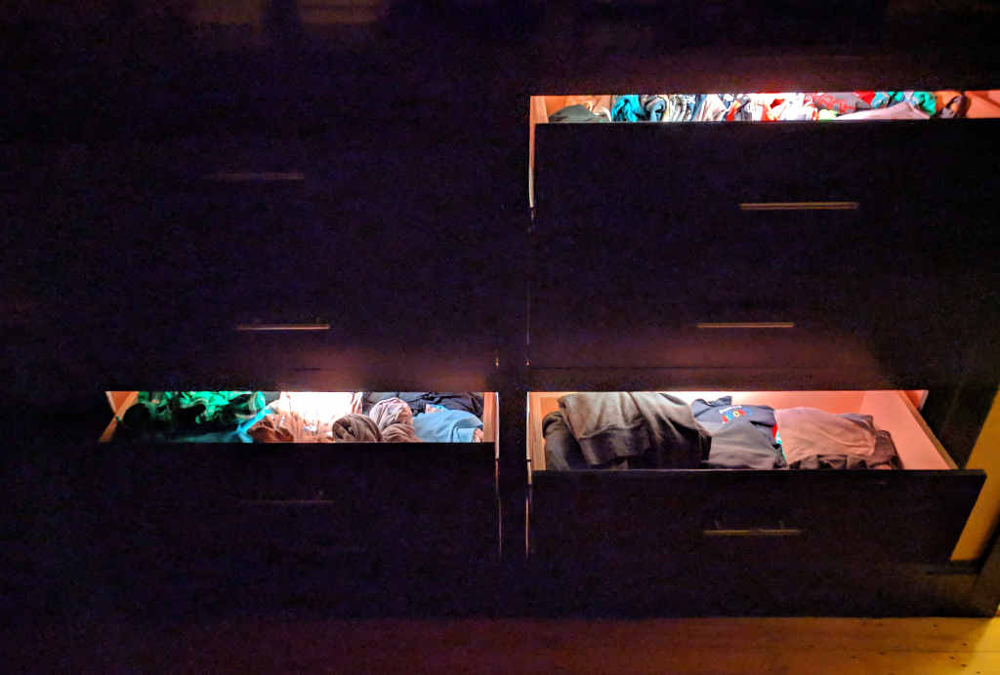

# Drawer Lights

LED lighting for dresser drawers, with brightness and hue response to ambient light, and per-drawer switching.

[Demo video](img/drawerlights.webm).

## Construction

I started with a full-scale cardboard mockup of the inside of the dresser, so I could leave the drawers in the dresser while I measured wires and tested the implementation.

I used finishing nails to attach the switches to small wood blocks (the switches have two convenient mounting holes).

I ended up using a staple gun to secure both lamp wire and servo wires. To avoid crushing the insulation (especially on the servo wire), I made a cardboard shim and guide for the nose of the staple gun.

I drilled vertical holes through the blocking to which the drawer slides are mounted, so I could route wires up from one drawer to the next without going all the way back to the wall (where there was a gap). I used a right-angle drill bit adapter and a 1/2" drill bit.

## Control Circuit

The circuit has switches as inputs to detect when the drawers are opened, a voltage divider with the photoresistor to detect ambient light, a digital output to drive the NeoPixels, and then some standard trimmings (filter capacitor on the power supply, reset switch, SPI header).

I used the free version of EAGLE (see files in the `eagle/` subdirectory), and used its autorouting on the PCB. Although there's a resistor at the control-board end of the data line to the NeoPixels, after burning out one pixel, I also added a resistor at the LED-end of that wire too (as recommended).

I used servo wire to connect data and 5V between the sections of LED strip. The servo wire is 22AWG, which is rated to carry 0.92A max and 16 ohms/ft. I used lamp wire to feed power to the ends and center of the LEDs. The lamp wire is 18AWG, which is rated 2.3A max / 6 ohms/ft. Until I added the center supply, I observed flaky data transmission in the middle of the LEDs.

I also used servo wire to connect ground and a digital input to each switch.

## Parts

*   5V 10A power supply [$10.99 from RobotShop](https://www.robotshop.com/en/switching-power-supply-5v-10a.html)
*   grounded mains power cord (scavenged from a curbside microwave oven)
*   addressable LEDs: NeoPixel 1m strip with 60 LEDs [$24.95 from Adafruit](https://www.adafruit.com/product/1138) (I had WS2812(S), not SK6812 which are becoming more common)
*   8 SPDT roller lever micro switches [$12.45 from RobotShop](https://www.robotshop.com/en/spdt-roller-lever-micro-switch-2pk.html)
*   servo wire [50' for $11.29 from RobotShop](https://www.robotshop.com/en/50-feet-heavy-duty-servo-wire-22-gauge.html)
*   servo connectors [$2.76 for 10 male pigtails from HobbyKing](https://hobbyking.com/en_us/15cm-male-22awg-twisted-10pcs-bag.html)
*   18/2 lamp wire [$20.27 for 100' from Home Depot](https://www.homedepot.com/p/Southwire-100-ft-18-2-White-Stranded-CU-SPT-1-Lamp-Wire-49909503/304781532)
*   photo cell / photoresistor [$0.95 from Adafruit](https://www.adafruit.com/product/161)

The power supply hisses when under low/no load. Between 84mA and 300mA the hiss is audible, but by 600mA it's quiet. Luckily, wood and clothing damps the noise sufficiently. The PSU also has a trim for output voltage. After destroying one NeoPixel strip, I adjusted the voltage from 5V down to 4.90V. (I haven't observed any variation in the output when, for example, running a corded drill off the same outlet as the PSU is plugged into.)

The 60-LED/m NeoPixel strip specification says 3.5A/m at 5V. This setup uses 7 LEDs on each of 8 drawers, and the brightest color displayed is (255, 255, 50) (that is, red and green fully on, and blue fairly dim). With all 56 LEDs displaying that color, the system draws 2.096A at 5V, so in fact a 10A power supply is significantly oversized.

For the control board:

*   custom PCB from [OSH Park](https://oshpark.com), $15.30 for a minimum run of 3
*   ATMega328 with bootloader [$5.50 from SparkFun](https://www.sparkfun.com/products/10524) though there are cheaper options
*   28-pin DIP socket [$0.95](https://www.sparkfun.com/products/7942)
*   filter capacitor: 1000 micro Farads, 6.3V (scavenged from something)
*   tactile switch button for reset switch [$4.95 for 20 from Adafruit](https://www.adafruit.com/product/1489)
*   resistors for example from [$7.95 resistor kit from Sparkfun](https://www.sparkfun.com/products/10969)
*   headers for example from [$4.95 10x 36-pin from Adafruit](https://www.adafruit.com/product/392)

I uploaded the Arduino sketch to the ATMega328 using [Sparkfun's Tiny AVR programmer](https://www.sparkfun.com/products/11801); [more notes](https://github.com/markfickett/spinner#bare-atmega-programming).

Tools for assembly:

*   right-angle drill adapter [$17.97 from Home Depot](https://www.homedepot.com/p/DEWALT-Right-Angle-Drill-Adapter-DWARA50/203867866)
*   staple gun

